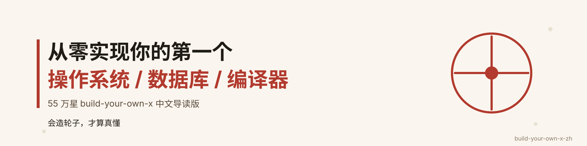

  

<h1 align="center">build-your-own-x-zh</h1>

<b>55 万 star 的「造轮子圣经」中文导读版</b> —— 从零实现你的第一个操作系统、数据库、编译器。

  
  
  
  

---

## 为什么是这一份？

GitHub 上收藏量最高的「从零实现」清单 [codecrafters-io/build-your-own-x](https://github.com/codecrafters-io/build-your-own-x)（**55 万 star**），收录了 50 多个「把某某技术从零造一遍」的顶级教程——操作系统、数据库、编译器、神经网络、3D 渲染器……原仓库很好，但**只给英文标题和外链**，英文苦手收藏三年也不敢动手。

这份中文导读版把它变成一条能照着走的路：

- **50 个精选选题**，按「系统底层 / 应用服务 / 开发工具 / 编程语言与算法 / 网络与协议 / 游戏与图形」6 大分类组织；
- 每个选题配 **中文标题 + 一句话中文简介 + 推荐中文学习资源**（中文教程 / 中文书 / 中文课程 / 开源参考实现），附 **难度星级 ★~★★★★★** 与 **建议学习顺序编号**；
- 实在找不到中文资源的选题，**诚实标注「暂无中文资源，可用英文原教程」**并附官方链接，绝不硬凑；
- 每题的英文原教程链接全部保留，方便对照原文深入。

> *What I cannot create, I do not understand. —— Richard Feynman*
>
> 会造轮子，才算真懂。造完 10 个，你简历上多 6 类硬通货。

## 新人入门 10 题

别一上来就啃操作系统。先按下面的顺序做这 10 个，每个都能在 1-2 周内完成，成就感拉满：

| # | 选题 | 难度 | 一句话简介 |
| --- | --- | --- | --- |
| 01 | 从零写一个命令行工具 | ★★ | 从参数解析到打包分发，做一个自己日常真愿意天天用的命令行小工具。 |
| 02 | 从零写一个文本编辑器 | ★★★ | 在终端里敲出带语法高亮和搜索的编辑器，把 termios 与 ANSI 转码摸个底朝天。 |
| 03 | 从零写一个 Shell | ★★★ | 用几百行 C/Rust 写个能跑命令、能管道的小终端，进程与系统调用一次玩透。 |
| 04 | 从零写一个 Git | ★★★★ | 亲手复刻 Git 的对象库与提交模型，从此看懂 .git 目录里每个文件的来历。 |
| 05 | 从零写一个正则表达式引擎 | ★★★ | 把 a(b|c)*d 这类模式变成一台状态机：从编译正则到 NFA/DFA 匹配，揭开 `re` 模块背后的真功夫。 |
| 06 | 从零写一个 Web 服务器 | ★★★ | 不碰任何框架，用裸 socket 解析 HTTP 请求再吐出响应，弄明白一个 Web 服务器到底替你干了哪些脏活。 |
| 07 | 从零写一个数据库 | ★★★★ | 不借助任何现成引擎，从磁盘页、B+ 树到 SQL 解析，亲手攒出一个能跑增删改查的迷你数据库。 |
| 08 | 从零写一个 Redis | ★★★★ | 不依赖任何现成库，手写一个能被 redis-cli 连上的迷你内存数据库，把 RESP 协议、过期与持久化一次吃透。 |
| 09 | 从零写一个编译器 | ★★★★★ | 把「源代码变成机器码」这层魔法拆开：词法、语法、语义、代码生成，一步一个脚印写出来。 |
| 10 | 从零写一个解释器 | ★★★★ | 用不到百行 Python 读懂 eval/apply 的灵魂：解析 Lisp 表达式，亲手跑通一个能算斐波那契的迷你 Scheme。 |

> 完整条目（含中文学习资源与英文原教程链接）见下方分类正文，编号即建议顺序。

## 建议学习路径

## 50 个选题 · 6 大分类

## 分类正文

> 每个条目的「难度」为该选题的整体实现难度；编号是全局建议顺序，01-10 为入门十题，其后按难度由易到难递进。

## 系统底层类（9 题）

> 这一类是「造轮子」的硬核区：操作系统、容器、模拟器、调试器……弄懂它们，你就弄懂了计算机的底层真相。

### 40 · 从零写一个操作系统（Build your own Operating System）

> 从开机引导到进程调度，亲手把「按下电源键后发生的一切」变成一行行自己能看懂的代码。

- **难度**：★★★★★
- **中文学习资源**
  - [Writing an OS in Rust（官方中文版）](https://os.phil-opp.com/zh-CN/) — 全球最流行的 Rust 写内核教程，图文加完整代码，自带中文翻译
  - [rCore-Tutorial-Book（清华 rCore 团队）](https://rcore-os.cn/rCore-Tutorial-Book-v3/) — 基于 RISC-V 从零实现操作系统，配套在线实验与开源代码
  - [《30 天自制操作系统》配套代码（Gitee）](https://gitee.com/ghosind/HariboteOS) — 日版经典教材的 NASM/GCC/Qemu 重构版，可在现代环境编译运行
- **英文原教程**：[Operating Systems: From 0 to 1](https://tuhdo.github.io/os01/) · [The little book about OS development](https://littleosbook.github.io/) · [How to create an OS from scratch](https://github.com/cfenollosa/os-tutorial)

### 41 · 从零写一个处理器（Build your own Processor）

> 用 Verilog 从一盏跑马灯开始，一路搭出能跑 C 程序的 RISC-V 小核，把「CPU 到底怎么算数」拆给你看。

- **难度**：★★★★★
- **中文学习资源**
  - [tinyriscv（Gitee，从零写极简 RISC-V 核）](https://gitee.com/liangkangnan/tinyriscv) — 三级流水线 RV32I 核，中文 README 配完整教程与仿真工程，注释友好、可直接上板
  - [《手把手教你设计CPU——RISC-V处理器篇》（蜂鸟 E203）](https://www.riscv-mcu.com/campus-campus-book-id-2.html) — 胡振波所著，国内最系统的 Verilog 设计 CPU 中文教材，配套 FPGA 原型平台
- **英文原教程**：[From Blinker to RISC-V（Verilog）](https://github.com/BrunoLevy/learn-fpga/tree/master/FemtoRV/TUTORIALS/FROM_BLINKER_TO_RISCV)

### 24 · 从零写一个内存分配器（Build your own Memory Allocator）

> 自己实现 malloc/free，搞懂堆块、空闲链表与碎片合并，面试里被追问的内存管理从此心中有数。

- **难度**：★★★★
- **中文学习资源**
  - [UIUC CS241 系统编程中文讲义：实现内存分配器](https://www.kancloud.cn/apachecn/uiuc-cs241-notes-zh/1945773) — 从块结构到链表策略，逐条讲透 malloc/free 的实现细节
  - [如何实现一个 malloc（电子工程专辑）](https://www.eet-china.com/mp/a397643.html) — 带完整 C 代码的手把手实现，涵盖对齐、块拆分与相邻合并
- **英文原教程**：[Malloc is not magic（C）](https://medium.com/p/e0354e914402) · [Malloc tutorial（C）](https://danluu.com/malloc-tutorial/)

### 25 · 从零写一个模拟器/虚拟机（Build your own Emulator / Virtual Machine）

> 用几百行 C 写一台能跑老游戏的小电脑，亲自体会「取指—译码—执行」那颗 CPU 的心跳。

- **难度**：★★★★
- **中文学习资源**
  - [手把手教你编写游戏模拟器（Chip-8 篇）](https://blog.csdn.net/korekara88730/article/details/50987930) — 连载系列，从内存映射到每个 opcode 逐条实现，中文注释齐全
  - [从 CHIP-8 入手 CPU 的模拟（腾讯云）](https://cloud.tencent.com/developer/article/1478665) — 结合 Qt 讲清 64×32 显存与指令循环的建模思路
- **英文原教程**：[Write your Own Virtual Machine（C，LC-3）](https://justinmeiners.github.io/lc3-vm/) · [CHIP-8 解释器（C++）](http://www.multigesture.net/articles/how-to-write-an-emulator-chip-8-interpreter/) · [Writing a Game Boy emulator, Cinoop（C）](https://cturt.github.io/cinoop.html)

### 26 · 从零写一个容器（Build your own Docker）

> 几十行 Go 调几个系统调用，做出一个能隔离进程、限额资源的迷你 Docker，拆穿容器的神秘面纱。

- **难度**：★★★★
- **中文学习资源**
  - [从无到有：用 Go 实现一个 Docker（CSDN）](https://blog.csdn.net/qq_33976344/article/details/121637134) — 手把手演示 namespace、cgroup 与 rootfs 三件套，代码可直接编译运行
- **英文原教程**：[Linux containers in 500 lines of code（C）](https://blog.lizzie.io/linux-containers-in-500-loc.html) · [Build Your Own Container Using Less than 100 Lines of Go](https://www.infoq.com/articles/build-a-container-golang) · [bocker：约 100 行 bash 实现 Docker](https://github.com/p8952/bocker)

### 13 · 从零写一个引导程序（Build your own Bootloader）

> 写一段 512 字节的汇编，让电脑开机后听你指挥，弄清「BIOS 之后、内核之前」到底发生了什么。

- **难度**：★★★
- **中文学习资源**
  - [图灵社区：引导程序主体代码精讲](https://m.ituring.com.cn/book/tupubarticle/26325) — 结合 BIOS 中断 INT 10h，逐行讲开机第一屏那段引导代码在做什么
  - [手写 x86 操作系统：引导程序与加载器实现（CSDN）](https://blog.csdn.net/weixin_51952055/article/details/140561088) — 从实模式到保护模式跳转，含 GDT 加载与 0x92 端口打开 A20
- **英文原教程**：[Writing a Tiny x86 Bootloader（汇编）](http://joebergeron.io/posts/post_two.html) · [Writing a Bootloader（C++）](http://3zanders.co.uk/2017/10/13/writing-a-bootloader/)

### 14 · 从零写一个终端模拟器（Build your own Terminal Emulator）

> 自己做一个能跑 vim、支持彩色输出的命令行窗口，搞懂 PTY 与那串看似神秘的转义序列。

- **难度**：★★★
- **中文学习资源**
  - [控制台虚拟终端序列（Microsoft Learn 中文）](https://learn.microsoft.com/zh-cn/windows/console/console-virtual-terminal-sequences) — 权威的 ANSI 转义序列中文参考，写解析器时必备对照表
  - [使用 ANSI 转义代码控制终端（Deno 中文文档）](https://docs.deno.org.cn/examples/ansi_terminal/) — 用最小示例讲清颜色、光标移动等常用序列怎么发出
- **英文原教程**：[Build A Simple Terminal Emulator In 100 Lines of Golang](https://ishuah.com/2021/03/10/build-a-terminal-emulator-in-100-lines-of-go/) · [The very basics of a terminal emulator（C）](https://www.uninformativ.de/blog/postings/2018-02-24/0/POSTING-en.html)

### 42 · 从零写一个调试器（Build your own Debugger）

> 用 ptrace 做出能下断点、读寄存器、单步执行的迷你 gdb，彻底看穿 GDB 背后到底在干什么。

- **难度**：★★★★★
- **中文学习资源**
  - [如何编写一个 Linux 程序的调试器（掘金译文）](https://juejin.cn/post/7402204217518391347) — 经典 Writing a Linux Debugger 系列的中文连载，从 ptrace 到断点一步步搭
  - [GDB 原理之 ptrace 实现（腾讯云）](https://cloud.tencent.com/developer/article/1742878) — 用最小示例讲清 PTRACE_TRACEME / GETREGS 的追踪模型
- **英文原教程**：[Writing a Linux Debugger（C++）](https://blog.tartanllama.xyz/writing-a-linux-debugger-setup/)

### 27 · 从零写一个系统调用（Write a System Call）

> 改一行内核源码、加一个调用号，让用户态程序调起你亲手加的内核函数，跑通用户态与内核态的边界。

- **难度**：★★★★
- **中文学习资源**
  - [添加新的系统调用（Linux 内核文档中文版）](https://linuxkernel.org.cn/doc/html/latest/process/adding-syscalls.html) — 官方内核文档的中文翻译，SYSCALL_DEFINEx 与调用表改动的权威步骤
  - [内核必须懂：用系统调用打印 Hello, world（阿里云）](https://developer.aliyun.com/article/641513) — 从写函数到编译内核、再到用户态触发，全程带代码
- **英文原教程**：[Write a System Call（C）](https://brennan.io/2016/11/14/kernel-dev-ep3/)

## 应用服务类（9 题）

> 这一类是「造轮子」的实用区：数据库、Redis、搜索引擎、区块链……每做完一个，简历上就多一行硬通货。

### 07 · 从零写一个数据库（Build your own Database）

> 不借助任何现成引擎，从磁盘页、B+ 树到 SQL 解析，亲手攒出一个能跑增删改查的迷你数据库。

- **难度**：★★★★
- **中文学习资源**
  - [MYDB：Java 从零实现数据库（Gitee）](https://gitee.com/yossi/MYDB) — 开源参考实现，覆盖 MVCC、两段锁、SQL 解析与崩溃恢复
  - [CMU 15-445 数据库系统（CS 自学指南）](https://csdiy.wiki/%E6%95%B0%E6%8D%AE%E5%BA%93%E7%B3%BB%E7%BB%9F/15445/) — 全球最硬核的「从零造数据库」课程，B 站有中英双语字幕版
- **英文原教程**：[Build Your Own Database from Scratch（Go，3000 行）](https://build-your-own.org/database/) · [Let's Build a Simple Database（C）](https://cstack.github.io/db_tutorial/)

### 08 · 从零写一个 Redis（Build your own Redis）

> 不依赖任何现成库，手写一个能被 redis-cli 连上的迷你内存数据库，把 RESP 协议、过期与持久化一次吃透。

- **难度**：★★★★
- **中文学习资源**
  - [《Redis 设计与实现》（黄健宏）](https://redisbook.readthedocs.io/en/latest/) — 经典中文开源书，逐章拆解 SDS、跳表、字典与事件模型，还配了带注释源码
  - [Redis 中文注释版源码（Gitee）](https://gitee.com/holyholly/redis) — 与官方库同步的逐行中文注释，读不动英文源码时的最佳拐杖
- **英文原教程**：[Build Your Own Redis from Scratch（C++）](https://build-your-own.org/redis) · [Build Your Own Redis from Scratch（Go）](https://www.build-redis-from-scratch.dev/) · [Rust：Build your own Redis client and server](https://tokio.rs/tokio/tutorial/setup)

### 43 · 从零写一个分布式消息系统（Build your own Distributed Systems / Kafka）

> 从一条日志落盘开始，攒出能扛多消费者组、可持久化、可回溯的分布式消息队列，看懂 Kafka 的内核思路。

- **难度**：★★★★★
- **中文学习资源**
  - [实战：从零仿 NSQ 打造高性能消息队列（掘金）](https://juejin.cn/post/7481917459596361755) — Go 手写 Topic/Channel 分发、磁盘持久化与延迟投递，含压测数据和踩坑经验
  - [从零手搓一个消息队列：消息在文件中的存储（CSDN）](https://blog.csdn.net/yzhcjl_/article/details/133442682) — 从单文件日志起步，讲清 MQ 最底层的落盘格式与消费偏移怎么记
- **英文原教程**：[Building Your Own Kafka-like System From Scratch（Java）](https://github.com/buildthingsuseful/build-your-own-kafka)

### 28 · 从零写一个搜索引擎（Build your own Search Engine）

> 自己分词、建倒排索引、算 TF-IDF 权重，攒出一个能按相关性给你排好结果的迷你搜索引擎。

- **难度**：★★★★
- **中文学习资源**
  - [手把手教你实现文档搜索引擎（腾讯云）](https://cloud.tencent.cn/developer/article/2498737) — C++ + jieba 分词，完整走通正排/倒排索引、权重打分与检索排序，是一套能跑的小项目
- **英文原教程**：[Building a Vector Space Indexing Engine in Python](https://boyter.org/2010/08/build-vector-space-search-engine-python/) · [Finding Important Words in Text Using TF-IDF](https://stevenloria.com/tf-idf/)

### 06 · 从零写一个 Web 服务器（Build your own Web Server）

> 不碰任何框架，用裸 socket 解析 HTTP 请求再吐出响应，弄明白一个 Web 服务器到底替你干了哪些脏活。

- **难度**：★★★
- **中文学习资源**
  - [从零实现一个简易 Web 服务器：原理与实践（SegmentFault）](https://segmentfault.com/a/1190000046471781) — 纯 socket 手写请求解析与响应拼装，几十行代码就跑起一个服务器
  - [所谓 WSGI（腾讯云）](https://cloud.tencent.com/developer/article/1971652) — 从 socket 一路讲到 WSGI 协议，搞懂服务器和 Python Web 框架之间到底约定了什么
- **英文原教程**：[Let's Build A Web Server（Python）](https://ruslanspivak.com/lsbaws-part1/) · [Build Your Own Web Server From Scratch In JavaScript](https://build-your-own.org/webserver/) · [A Simple Web Server（500L）](http://aosabook.org/en/500L/a-simple-web-server.html)

### 29 · 从零写一个 BitTorrent 客户端（Build your own BitTorrent Client）

> 解析种子文件、连上 tracker 和 DHT、跟 peer 一块块换数据，做出一个真能把文件下下来的 BT 客户端。

- **难度**：★★★★
- **中文学习资源**
  - [magnet、BitTorrent、BT 种子、DHT 网络（CSDN）](https://blog.csdn.net/raoxiaoya/article/details/150469521) — Go 实战，从解析 .torrent 与磁力链接到 DHT 找 peer，带完整可跑代码
  - [BitTorrent 协议分析与实现（中国科技论文在线）](https://www.paper.edu.cn/download/downpdf/paper/MUTGkF2QMRzVcIeQeQ) — 协议层学术梳理，讲清握手、分块交换与 choking 等规则
- **英文原教程**：[Building a BitTorrent client from the ground up in Go](https://blog.jse.li/posts/torrent/) · [A BitTorrent client in Python 3.5](http://markuseliasson.se/article/bittorrent-in-python/)

### 30 · 从零写一个区块链/加密货币（Build your own Blockchain / Cryptocurrency）

> 手写区块结构、工作量证明挖矿和 P2P 最长链共识，攒出一条能互相转账、还能分叉合并的迷你公链。

- **难度**：★★★★
- **中文学习资源**
  - [用 Python 从零开始创建区块链（腾讯云）](https://cloud.tencent.com/developer/article/1100975) — 经典教程的中文译注版，含工作量证明、P2P 节点与「最长链胜出」共识
  - [《深入浅出区块链》第 36 讲：搭建你的迷你区块链（实践篇）](https://learn.lianglianglee.com/%e4%b8%93%e6%a0%8f/%e6%b7%b1%e5%85%a5%e6%b5%85%e5%87%ba%e5%8c%ba%e5%9d%97%e9%93%be/%e7%ac%ac36%e8%ae%b2%20%e6%90%ad%e5%bb%ba%e4%bd%a0%e7%9a%84%e8%bf%b7%e4%bd%a0%e5%8c%ba%e5%9d%97%e9%93%be%ef%bc%88%e5%ae%9e%e8%b7%b5%e7%af%87%ef%bc%89.md) — C++ 实战 Tinychain，从挖矿、交易池到 P2P 广播完整走一遍，还观察难度自动调整
- **英文原教程**：[Learn Blockchains by Building One（Python）](https://hackernoon.com/learn-blockchains-by-building-one-117428612f46) · [Building Blockchain in Go](https://jeiwan.net/posts/building-blockchain-in-go-part-1/) · [Naivecoin（TypeScript）](https://lhartikk.github.io/)

### 15 · 从零写一个缓存系统（Build Your Own Cache）

> 从 LRU 淘汰和过期时间写起，一路做到能联网访问的缓存中间件，搞懂高并发下缓存到底是怎么扛住的。

- **难度**：★★★
- **中文学习资源**
  - [算法就像搭乐高：手撸 LRU 算法（labuladong）](https://labuladong.online/algo/data-structure/lru-cache/) — 哈希表 + 双向链表做到 O(1) 读写淘汰，图解把缓存最核心的数据结构讲透
  - [手写本地缓存实战（HeapDump 性能社区）](https://heapdump.cn/article/4882773) — Java 本地缓存，补齐过期时间、淘汰策略等缓存中间件的工程细节
- **英文原教程**：[Build Your Own Cache（Kotlin）](https://github.com/kezhenxu94/cache-lite)

### 16 · 从零写一个负载均衡器（Let's Create a Simple Load Balancer）

> 写一个反向代理，把流量按轮询、加权或一致性哈希分发给后端服务器，自己当一次全公司的流量调度中心。

- **难度**：★★★
- **中文学习资源**
  - [Go 实现负载均衡：平滑加权轮询（掘金）](https://juejin.cn/post/7332027975863664649) — 手写 Nginx 同款平滑加权轮询算法，请求分发的第一步就会了
  - [一文讲透一致性哈希的原理和实现（LearnKu）](https://learnku.com/articles/63136) — 一致性哈希 + 虚拟节点，Go 实现，解决节点上下线时尽量少迁移缓存的问题
- **英文原教程**：[Let's Create a Simple Load Balancer（Go）](https://kasvith.me/posts/lets-create-a-simple-lb-go/)

## 开发工具类（10 题）

> 这类轮子专门服务于开发者自己：亲手写一个 Git、Shell、编辑器或浏览器引擎，不仅能把天天在用的工具拆明白，还能顺带吃透操作系统、编译原理与前端工程化的硬核内功，写完日常效率直接翻倍。

### 04 · 从零写一个 Git（Build your own Git）

> 亲手复刻 Git 的对象库与提交模型，从此看懂 .git 目录里每个文件的来历。

- **难度**：★★★★
- **中文学习资源**
  - [Pro Git 第 9 章「Git 内部原理」（Gitee 中文版）](https://gitee.com/progit/9-Git-%E5%86%85%E9%83%A8%E5%8E%9F%E7%90%86.html) — 系统讲清 blob/tree/commit 对象与内容寻址存储，动手前的理论地基
  - [Git 的无实物表演（交互式中文可视化）](https://explore-git.sorosliu.xyz/) — 用可点击的演示亲手体会 SHA-1 对象库与分支引用模型
- **英文原教程**：[Write yourself a Git!（Python）](https://wyag.thb.lt/) · [ugit: Learn Git Internals by Building Git Yourself](https://www.leshenko.net/p/ugit/) · [Gitlet（JavaScript）](http://gitlet.maryrosecook.com/docs/gitlet.html)

### 03 · 从零写一个 Shell（Build your own Shell）

> 用几百行 C/Rust 写个能跑命令、能管道的小终端，进程与系统调用一次玩透。

- **难度**：★★★
- **中文学习资源**
  - [手写一个自己的 shell：从字符串解析到内建命令（腾讯云）](https://cloud.tencent.com/developer/article/2747748) — 把 fork/exec/waitpid 串成一条可读的最小主循环
  - [手搓 Linux Shell 命令行解释器（腾讯云）](https://developer.cloud.tencent.cn/article/2619619) — 按「读取→解析→执行→反馈」四步搭出属于你的终端
- **英文原教程**：[Tutorial - Write a Shell in C](https://brennan.io/2015/01/16/write-a-shell-in-c/) · [Build Your Own Shell using Rust](https://www.joshmcguigan.com/blog/build-your-own-shell-rust/)

### 02 · 从零写一个文本编辑器（Build your own Text Editor）

> 在终端里敲出带语法高亮和搜索的编辑器，把 termios 与 ANSI 转码摸个底朝天。

- **难度**：★★★
- **中文学习资源**
  - [单文件 C 文本编辑器 kilo（Gitee 中文 step-by-step 教程）](https://gitee.com/mancuojie/c-kilo-text-editor) — 逐段注解的中文实操，从进入 raw 模式到滚动、编辑、高亮全流程
- **英文原教程**：[Build Your Own Text Editor（kilo，C）](https://viewsourcecode.org/snaptoken/kilo/) · [Hecto: Build your own text editor in Rust](https://www.flenker.blog/hecto/)

### 01 · 从零写一个命令行工具（Build your own Command-Line Tool）

> 从参数解析到打包分发，做一个自己日常真愿意天天用的命令行小工具。

- **难度**：★★
- **中文学习资源**
  - [《Rust 程序设计语言》中文版 · 第 12 章 I/O 项目：构建命令行程序](https://kaisery.github.io/trpl-zh-cn/) — 用 TDD 手把手写一个 mini grep，覆盖参数解析、环境变量与错误处理
- **英文原教程**：[Command line apps in Rust](https://rust-cli.github.io/book/index.html) · [Build a command line app with Go: cowsay](https://flaviocopes.com/go-tutorial-cowsay/)

### 11 · 从零写一个模板引擎（Build your own Template Engine）

> 几十行代码把 {{ }} 模板编译成 HTML，看懂 Vue/EJS 渲染背后的套路。

- **难度**：★★
- **中文学习资源**
  - [100 来行代码，自己动手写一个模板引擎（掘金）](https://juejin.cn/post/6844903912646901774) — 一张图讲清 EJS 原理，从正则替换到 new Function 编译
  - [underscore 系列之实现一个模板引擎（掘金）](https://juejin.cn/post/6844903555434807309) — 从 underscore.template 源码拆解 <% %> 的编译思路
- **英文原教程**：[JavaScript template engine in just 20 lines](http://krasimirtsonev.com/blog/article/Javascript-template-engine-in-just-20-line) · [A Template Engine（500L，Python）](http://aosabook.org/en/500L/a-template-engine.html)

### 31 · 从零写一个模块打包器（Build your own Module Bundler）

> 复刻 minipack，从 AST 依赖图到 IIFE 输出，搞懂 webpack 到底在打包什么。

- **难度**：★★★★
- **中文学习资源**
  - [通过 Minipack 学习 webpack 构建原理（掘金）](https://juejin.cn/post/7500070714658340891) — 复刻 minipack：AST 解析→依赖图→IIFE 打包三步走
  - [从 minipack 理解打包工具的基本原理（SegmentFault）](https://segmentfault.com/a/1190000022417794) — 逐行读迷你打包器，看懂依赖图谱是怎么建立起来的
- **英文原教程**：[Minipack（JavaScript）](https://github.com/ronami/minipack)

### 32 · 从零写一个包管理器（Build your own Package Manager）

> 手写一个能解析依赖、下载并铺好 node_modules 的迷你 npm，读懂 pnpm 硬链接之美。

- **难度**：★★★★
- **中文学习资源**
  - [深入浅出 Yarn 包管理（掘金）](https://juejin.cn/post/6927086350877343752) — 跟着 Yarn 官方教程中文版，从递归解析依赖树到把包链接进 node_modules
  - [从 npm 到 Yarn 到 pnpm：包管理工具演进（掘金）](https://juejin.cn/post/7515392598099378211) — 讲清内容寻址存储、硬链接与依赖扁平化的设计权衡
- **英文原教程**：[Tiny Package Manager（TypeScript）](https://github.com/g-plane/tiny-package-manager)

### 33 · 从零写一个前端框架（Build your own Front-end Framework / React）

> 用不到三百行实现 createElement、render、Fiber 与 Hooks，亲手拆穿 React 的黑盒。

- **难度**：★★★★
- **中文学习资源**
  - [How to build your own React：Didact 解析（掘金）](https://juejin.cn/post/7187613323699945532) — 逐段拆解 Didact，从 createElement/render 一路讲到 Fiber 与 Hooks
  - [手写 mini-react：超万字实现首次渲染流程（掘金）](https://juejin.cn/post/7315773030985809954) — 中文长文，把 workInProgress 树与双缓冲调度讲透
- **英文原教程**：[Build your own React](https://pomb.us/build-your-own-react/) · [Didact：A DIY guide to build your own React](https://github.com/hexacta/didact)

### 17 · 从零写一个静态站点生成器（Build a Static Site Generator）

> 把一堆 Markdown 一键拼成静态博客，搞懂 Hexo/Astro 构建时到底做了什么。

- **难度**：★★★
- **中文学习资源**
  - [手搓一个零依赖的 Markdown 静态站点生成器（掘金）](https://juejin.cn/post/7666036053727920163) — 只用 Node 标准库把 Markdown 拼成 HTML，跑通 SSG 的最小闭环
- **英文原教程**：[Build a static site generator in 40 lines with Node.js](https://www.webdevdrops.com/en/build-static-site-generator-nodejs-8969ebe34b22/)

### 44 · 从零写一个浏览器引擎（Build your own Web Browser）

> 从零写一个能解析 HTML/CSS、排版并画页面的迷你浏览器，打通整条渲染管线。

- **难度**：★★★★★
- **中文学习资源**
  - [【译】让我们来构建一个浏览器引擎吧（掘金）](https://juejin.cn/post/6914663889426726920) — mbrubeck「Robinson」系列的中文全译，从 HTML/CSS 解析到布局与绘制
  - [探索浏览器底层并实现简易浏览器（掘金）](https://juejin.cn/post/7509894533640749090) — 基于 browser.engineering 的中文实操连载，含网络请求与渲染流程
- **英文原教程**：[Let's build a browser engine（Rust）](https://limpet.net/mbrubeck/2014/08/08/toy-layout-engine-1.html) · [Browser Engineering（Python）](https://browser.engineering)

## 编程语言与算法类（9 题）

> 这一类是「造轮子」的智力区：编译器、解释器、正则引擎、神经网络……看懂别人写的，不如自己写一个。

### 09 · 从零写一个编译器（Build your own Compiler）

> 把「源代码变成机器码」这层魔法拆开：词法、语法、语义、代码生成，一步一个脚印写出来。

- **难度**：★★★★★
- **中文学习资源**
  - [《Crafting Interpreters》中文翻译（Gitee）](https://gitee.com/GuoYaxiang/craftinginterpreters_zh) — 手写语言 Lox 的解释器与虚拟机，中文译本基本完成
  - [Crafting Interpreters 在线中文版](https://craftinginterpreters.fullstack.org.cn/) — 同一本书的在线阅读中文版，适合边读边敲
- **英文原教程**：[Crafting Interpreters](https://craftinginterpreters.com/) · [Let's Build a Compiler（Crenshaw 经典）](https://compilers.iecc.com/crenshaw/) · [From Source Code To Machine Code](https://build-your-own.org/compiler/)
### 10 · 从零写一个解释器（Build your own Interpreter / Lisp）

> 用不到百行 Python 读懂 eval/apply 的灵魂：解析 Lisp 表达式，亲手跑通一个能算斐波那契的迷你 Scheme。

- **难度**：★★★★
- **中文学习资源**
  - [SICP Python 描述 中文版 · 抽象语言的解释器](https://wizardforcel.gitbooks.io/sicp-py/content/3.6.html) — 经典教材中文化，讲透元循环求值器里 eval 与 apply 的分工
- **英文原教程**：[How to Write a Lisp Interpreter in Python（Norvig）](http://norvig.com/lispy.html) · [mal - Make a Lisp](https://github.com/kanaka/mal) · [Write Yourself a Scheme in 48 Hours](https://en.wikibooks.org/wiki/Write_Yourself_a_Scheme_in_48_Hours)

### 05 · 从零写一个正则表达式引擎（Build your own Regex Engine）

> 把 `a(b|c)*d` 这类模式变成一台状态机：从编译正则到 NFA/DFA 匹配，揭开 `re` 模块背后的真功夫。

- **难度**：★★★
- **中文学习资源**
  - [自己动手写编译器：代码实现正则表达式到 NFA 状态机（CSDN）](https://blog.csdn.net/tyler_download/article/details/127033969) — 系列实战文，用 Go 手把手把正则编译成 NFA，代码可逐行跟
- **英文原教程**：[Regular Expression Matching Can Be Simple And Fast（Russ Cox）](https://swtch.com/~rsc/regexp/regexp1.html) · [Build Your Own Regular Expression Engines: Backtracking, NFA, DFA](https://build-your-own.org/b2a/r0_intro) · [Build a Regex Engine in Less than 40 Lines（JS）](https://nickdrane.com/build-your-own-regex/)

### 34 · 从零写一个神经网络（Build your own Neural Network）

> 不依赖任何框架，纯 NumPy 搭出能识别样本的网络：前向传播、反向传播、梯度下降全自己写一遍。

- **难度**：★★★★
- **中文学习资源**
  - [从基本原理到梯度下降，小白都能看懂的神经网络教程（腾讯云）](https://cloud.tencent.com/developer/article/2457649) — 拿具体数值手算一遍反向传播，把链式求导讲得平易近人
- **英文原教程**：[Neural Networks: Zero to Hero（Karpathy）](https://www.youtube.com/playlist?list=PLAqhIrjkxbuWI23v9cThsA9GvCAUhRvKZ) · [A Neural Network in 11 lines of Python](https://iamtrask.github.io/2015/07/12/basic-python-network/)

### 45 · 从零写一个深度学习框架（Build a Deep Learning Library）

> 手写一个迷你 PyTorch：张量运算、自动求导、动态计算图都自己实现，从此看懂 `loss.backward()` 到底干了啥。

- **难度**：★★★★★
- **中文学习资源**
  - [PyTorch 中文文档 · 扩展 torch.autograd](https://pytorch.ac.cn/docs/2.6/notes/extending.html) — 官方中文说明 autograd 如何记录运算历史、求梯度，是造框架前的必读
- **英文原教程**：[SlowTorch: Implementation of PyTorch from the ground up](https://github.com/xames3/slowtorch) · [Build Deep Learning From Scratch](https://github.com/roiamiel1/Build-Deep-Learning-From-Scratch)

### 46 · 从零写一个垃圾回收器（Build your own Garbage Collector）

> 用 C 亲手实现标记-清除与复制算法：搞清楚对象图怎么遍历、死对象怎么回收，告别只会 `malloc/free`。

- **难度**：★★★★★
- **中文学习资源**
  - [从零开始，手写 GC 算法：标记-清除（掘金，附可运行源码）](https://juejin.cn/post/6945452297069527071) — 参考经典 GC 书，C 语言实现标记清除，代码完整可跑
  - [Crafting Interpreters 中文译本 · 垃圾回收](https://zaslee.github.io/craftinginterpreters/garbage-collection.html) — 中文对照讲解标记清除与半空间复制回收的取舍
- **英文原教程**：[Baby's First Garbage Collector（C）](http://journal.stuffwithstuff.com/2013/12/08/babys-first-garbage-collector/) · [Writing a Simple Garbage Collector in C](http://maplant.com/gc.html)

### 18 · 从零写一个哈希表（Build your own Hash Table）

> 不依赖任何语言内置字典，用 C 手写一张哈希表：哈希函数、冲突解决、动态扩容一次到位。

- **难度**：★★★
- **中文学习资源**
  - [C 语言手撕一个 Hash 表（CSDN）](https://blog.csdn.net/weixin_43903639/article/details/129720549) — 从开放寻址到链地址法，配 C 代码讲清冲突处理
- **英文原教程**：[Learn how to write a hash table in C](https://github.com/jamesroutley/write-a-hash-table)

### 19 · 从零实现机器学习算法（Learn ML Algorithms by coding）

> 抛开 scikit-learn，纯 NumPy 写出一棵能做分类的决策树：信息增益、基尼系数、递归划分自己算一遍。

- **难度**：★★★
- **中文学习资源**
  - [【机器学习】ID3、C4.5、CART 算法（腾讯云）](https://cloud.tencent.com/developer/article/2454343) — 对比三种决策树划分准则，把熵与信息增益讲透
- **英文原教程**：[Learn ML Algorithms by coding: Decision Trees](https://lethalbrains.com/learn-ml-algorithms-by-coding-decision-trees-439ac503c9a4)

### 47 · 从零写一个视频编码器（Video Encoding from Scratch）

> 把一串原始帧压成 H.264 码流：预测残差、量化、熵编码全自己来，理解视频为什么能压得这么小。

- **难度**：★★★★★
- **中文学习资源**
  - [H.264 编码管线与码流拆解：从残差、量化到 NALU（博客）](https://blog.mickeyzzc.tech/posts/network/h264-pipeline-bitstream/) — 中文长文，沿编码流水线逐环节讲清原理与码流结构
  - [H.264 的基本原理（菜鸟笔记）](https://www.coonote.com/note/h264-principle.html) — 帧内/帧间压缩与 I/P/B 帧的通俗入门
- **英文原教程**：[Video Encoding from Scratch（Go）](https://github.com/kevmo314/codec-from-scratch)

## 网络与协议类（6 题）
> 这类是把互联网的底层协议一个个拆开重造：从 TCP/IP 协议栈到 DNS 解析，再到 WebSocket、MQTT、聊天服务和 VPN 隧道——亲手写一遍，才算真正看懂了网线那头在发生什么。

### 48 · 从零写一个网络协议栈（Let's code a TCP/IP stack）

> 把操作系统里看不见的 TCP/IP 栈亲手敲一遍，从此抓包分析再也不发懵。

- **难度**：★★★★★
- **中文学习资源**
  - [南京大学计算机网络实验（TCP 部分）](https://nasa.nju.edu.cn/tutorial/exp2/) — 南大官方实验文档，从 ARP 到 TCP 状态机一步步带你实现，评分点清晰
  - [清华大学 TCP 网络栈实验](https://lab.cs.tsinghua.edu.cn/tcp/doc/requirement/) — 清华国家级实验教学中心出品，单人完成一个完整 TCP 栈的必选与限选功能清单
- **英文原教程**：[Let's code a TCP/IP stack（C）](http://www.saminiir.com/lets-code-tcp-ip-stack-1-ethernet-arp/) · [Beej's Guide to Network Programming（C）](http://beej.us/guide/bgnet/)

### 20 · 从零写一个 DNS 服务器（Build a DNS Server）

> 自己搭一台域名解析服务器，让输入域名就能在你的机器上找到 IP 地址。

- **难度**：★★★
- **中文学习资源**
  - [DNS 域名解析全流程及递归迭代查询原理](https://developer.aliyun.com/article/1657637) — 阿里云开发者社区，把递归与迭代查询的来龙去脉讲得很透
  - [多张图带你彻底搞懂 DNS 域名解析过程](https://www.coonote.com/network-note/domain-name-resolution-process.html) — 图文并茂，适合先建立全局认知再动手写报文解析
- **英文原教程**：[Build a DNS Server in Node.js](https://engineerhead.github.io/dns-server/) · [Building a DNS server in Rust](https://github.com/EmilHernvall/dnsguide/blob/master/README.md)

### 21 · 从零写一个 WebSocket 服务器（Build your own WebSocket Server）

> 手写一次 HTTP 升级握手和帧解析，彻底搞懂实时双向通信的底层门道。

- **难度**：★★★
- **中文学习资源**
  - [MDN 中文：编写 WebSocket 服务器](https://developer.mozilla.org/zh-CN/docs/Web/API/WebSockets_API/Writing_WebSocket_servers) — 权威规范译文，握手响应和帧格式讲得最准确
  - [万字长文，一篇吃透 WebSocket](https://cloud.tencent.com/developer/article/1887095) — 从概念到原理到动手实践，Sec-WebSocket-Accept 计算过程拆解到位
- **英文原教程**：[Building a simple websockets server from scratch in Ruby](http://blog.honeybadger.io/building-a-simple-websockets-server-from-scratch-in-ruby/)

### 35 · 从零写一个 MQTT 消息代理（Build your own MQTT Broker）

> 造一个物联网世界的"邮局"，让发布者和订阅者互不相识却能精准收信。

- **难度**：★★★★
- **中文学习资源**
  - [带你搞懂物联网常用的 MQTT 协议](https://www.eet-china.com/mp/a415646.html) — 电子工程专辑出品，QoS 三级和保留消息的概念讲得很清楚
  - [MQTT 协议详解与边缘计算场景下的架构设计](https://www.51cto.com/article/841390.html) — 51CTO 深度长文，QoS2 四次握手流程拆解到位，适合动手前先吃透协议
- **英文原教程**：[Sol - An MQTT broker from scratch（C）](https://codepr.github.io/posts/sol-mqtt-broker)

### 36 · 从零写一个聊天服务（Writing Scalable Chat Service）

> 从单机广播一路走到分布式 IM，理解高并发聊天背后的架构取舍与状态管理。

- **难度**：★★★★
- **中文学习资源**
  - [Go 语言实战：编写一个简易聊天室服务端](https://www.cnblogs.com/topkul/articles/19020843) — 博客园实战文，多客户端连接加消息广播的完整代码可跑可改
  - [集群聊天服务器系列（C++ muduo）](https://blog.csdn.net/m0_73537205/article/details/139072780) — 从用户登录到群组聊天的完整系列，带你从单机版走向分布式集群
- **英文原教程**：[Writing Scalable Chat Service from Scratch（Rust）](https://nbaksalyar.github.io/2015/07/10/writing-chat-in-rust.html) · [C# Networking: TCP chat server](https://16bpp.net/tutorials/csharp-networking)

### 37 · 从零写一个 VPN/虚拟交换机（Build your own VPN/Virtual Switch）

> 通过 TUN 虚拟网卡自己造一条加密隧道，把两台异地电脑拉进同一个局域网。

- **难度**：★★★★
- **中文学习资源**
  - [Linux Tun/Tap 设备介绍](https://www.zhaohuabing.com/post/2020-02-24-linux-taptun/) — 云原生专家赵化冰的博客，TUN/TAP 原理与编程接口讲得深入浅出
  - [SEED 实验室：VPN 隧道实验（中文 PDF）](https://seedsecuritylabs.org/Labs_20.04/Files_cn/VPN_Tunnel_cn.pdf) — 安全实验课中文讲义，手把手带你用 TUN 设备搭一个可用的 VPN 隧道
- **英文原教程**：[Build your own VPN/Virtual Switch（C/Python）](https://github.com/peiyuanix/build-your-own-zerotier)

## 游戏与图形类（7 题）
> 这类轮子最"有反馈"：写完不是一堆算法题，而是屏幕上真的有画面在动、有方块在弹跳、有相机在追踪标记——眼睛和手同时被喂饱。

### 49 · 从零写一个 3D 渲染器（Build your own 3D Renderer）

> 跳过现成图形 API，用 CPU 一行行算像素，把课本里的向量、矩阵和光照变成一张会反光的图。

- **难度**：★★★★★
- **中文学习资源**
  - [Ray Tracing in One Weekend 中文跟练笔记（CSDN）](https://blog.csdn.net/qq_43419761/article/details/128139487) — 逐章复现这本光线跟踪入门神书，把蒙特卡洛采样与漫反射讲到能动手
  - [软件渲染器 tinyrenderer 笔记（CSDN）](https://blog.csdn.net/LIJIWEI0611/article/details/145400937) — 跟着 ssloy 用 500 行代码手搓光栅化三角形，全程不碰 GPU
- **英文原教程**：[Ray Tracing in One Weekend（C++）](https://raytracing.github.io/books/RayTracingInOneWeekend.html) · [How OpenGL works: software rendering in 500 lines（tinyrenderer）](https://github.com/ssloy/tinyrenderer/wiki) · [Computer Graphics from scratch](http://www.gabrielgambetta.com/computer-graphics-from-scratch/introduction.html)

### 50 · 从零写一个游戏引擎（Make your own Game Engine）

> 不打开 Unity，自己搭窗口、写游戏循环、管渲染与输入，做一个能跑自家游戏的"小 Unity"。

- **难度**：★★★★★
- **中文学习资源**
  - [GAMES104 - 现代游戏引擎入门必修课（网易雷火）](https://games104.boomingtech.com/) — 系统讲现代引擎架构与各核心系统原理，配套开源迷你引擎 Piccolo 可从 0 搭一遍
  - [基于 C++ 的游戏引擎设计与实现（B站，中英字幕）](https://www.bilibili.com/video/BV17wKQ6sE4d/) — 直播式从零搭窗口、输入与渲染管线，边做边调试
- **英文原教程**：[Make your own Game Engine（视频系列）](https://www.youtube.com/playlist?list=PLlrATfBNZ98dC-V-N3m0Go4deliWHPFwT) · [Code a 2D Game Engine using Java（视频）](https://www.youtube.com/watch?v=025QFeZfeyM)

### 38 · 从零写一个物理引擎（Build your own Physics Engine）

> 让箱子真的会叠、球真的会弹，亲手把积分、碰撞检测和冲量求解从公式写成游戏里的刚体世界。

- **难度**：★★★★
- **中文学习资源**
  - [物理引擎笔记（BlackGlory）](https://blackglory.me/notes/physics-engine) — 系统梳理球形关节、铰链、点对点约束等模型，中文里少见的成体系总结
  - [C 语言实现简单物理引擎（CSDN）](https://blog.csdn.net/2301_81238088/article/details/148608754) — 从刚体结构体到圆形碰撞与弹性响应，适合先跑通最小闭环
- **英文原教程**：[How to Create a Custom Physics Engine](https://gamedevelopment.tutsplus.com/series/how-to-create-a-custom-physics-engine--gamedev-12715) · [Build a simple 2D physics engine for JavaScript games](https://developer.ibm.com/tutorials/wa-build2dphysicsengine/)

### 39 · 从零写一个体素引擎（Build your own Voxel Engine）

> 做一个能拆方块、放方块的"迷你 Minecraft"，搞懂区块、网格合并和无限地形为什么是它的命门。

- **难度**：★★★★
- **中文学习资源**
  - [记一次手搓简单的 Minecraft（jeanhua's blog）](https://www.blog.jeanhua.cn/2025/08/24/9c9ca101175f/) — 从 OpenGL 画三角形起步搭出可交互方块世界，代码已开源
  - [用 OpenGL 写一个简单的 Minecraft 渲染 Demo（hhhxiao）](https://hhhxiao.github.io/posts/762f/) — 重点讲区块建模与 SubChunk 网格组织，配图配代码
- **英文原教程**：[Let's Make a Voxel Engine（C++）](https://sites.google.com/site/letsmakeavoxelengine/home)

### 12 · 从零写一个 2D 游戏（Build your own 2D Game）

> 把贪吃蛇或俄罗斯方块从概念写到能玩，跑通"状态—输入—更新—渲染"这个所有游戏的最小骨架。

- **难度**：★★
- **中文学习资源**
  - [手把手教你实现贪吃蛇（CSDN）](https://blog.csdn.net/liwuqianhzc/article/details/138008748) — 用 C + Win32 控制台讲清地图、蛇身链表与按键节奏，代码完整可跑
- **英文原教程**：[On Tetris and Reimplementation（C）](https://brennan.io/2015/06/12/tetris-reimplementation/) · [How to build Snake using only JavaScript, HTML & CSS](https://medium.freecodecamp.org/think-like-a-programmer-how-to-build-snake-using-only-javascript-html-and-css-7b1479c3339e) · [Making Games with Python & Pygame](https://inventwithpython.com/makinggames.pdf)

### 22 · 从零写一个 Roguelike 游戏（Build your own Roguelike）

> 在黑底字符屏上生成随机地牢、设计玩家与怪物，把"永久死亡+随机迷宫"这个经典循环做出来。

- **难度**：★★★
- **中文学习资源**
  - [Godot 4 从零开发俯视角 Roguelike 射击游戏（B站，完结）](https://www.bilibili.com/video/BV181Ju6wEZA/) — 虽基于 Godot 而非裸写，但完整覆盖随机地牢生成、房间走廊连接、敌人 AI 与掉落系统，设计思路可迁移
- **英文原教程**：[Roguelike Tutorial Revised（Python）](http://rogueliketutorials.com/) · [How to Make Your First Roguelike（JS）](https://gamedevelopment.tutsplus.com/tutorials/how-to-make-your-first-roguelike--gamedev-13677) · [Roguelike Tutorial in Rust + tcod](https://tomassedovic.github.io/roguelike-tutorial/)

### 23 · 从零写一个增强现实应用（Build your own Augmented Reality）

> 摄像头一照桌上的纸，屏幕上就弹出一个立在纸上的 3D 物体——亲手串起标记识别与位姿估计。

- **难度**：★★★
- **中文学习资源**
  - [ArUco 标记和板检测，用于稳健的相机位姿估计（OpenCV 中文官方文档）](https://docs.opencv.ac.cn/5.0/main_modules/objdetect_aruco.html) — OpenCV 官方中文教程，讲清标记字典、检测与位姿估计 API
  - [增强现实入门实战：用 ArUco 标记实现 AR（CSDN）](https://blog.csdn.net/sinat_17456165/article/details/105649131) — 用单应矩阵把图像贴到纸上，一个最小可跑的 AR demo
- **英文原教程**：[Augmented Reality with Python and OpenCV](https://bitesofcode.wordpress.com/2017/09/12/augmented-reality-with-python-and-opencv-part-1/) · [Unity ARCore 教程（视频）](https://www.youtube.com/playlist?list=PLKIKuXdn4ZMjuUAtdQfK1vwTZPQn_rgSv)

---

## 怎么用

1. **别收藏了，直接做**：从「新人入门 10 题」挑一个，点进「英文原教程」跟着敲，中文资源当字典查；
2. **按编号走**：01-10 建立手感，11-30 练工程能力，31-50 冲击硬核；
3. **做完就提交**：把每个项目丢进自己的 GitHub，面试时这就是你的「作品集」。

## 参与贡献

- 发现某个选题有更好的中文资源？欢迎提 PR 补充（格式见 `topics/` 下任一文件）；
- 想加新选题？先看原仓库有没有收录，避免重复；
- Issue、PR、Star 都欢迎。

## 许可与致谢

- 本仓库改编自 [codecrafters-io/build-your-own-x](https://github.com/codecrafters-io/build-your-own-x)（CC0 公有领域），改编说明与致谢见 [THIRD_PARTY_NOTICES.md](THIRD_PARTY_NOTICES.md)；
- 本仓库新增内容（README、中文撰写、SVG 配图）按 **MIT License** 发布，见 [LICENSE](LICENSE)；
- 分类源文件见 `topics/` 目录（与 README 正文一致，方便维护与贡献）。
